# Getting Started

## Installation

To install Dnotebooks, you must have Node.js installed. If you do not have it, following the official guide here to install it. 

Once Node.js is installed, you can install Dnotebook by running the command below on a terminal:

```text
npm install -g dnotebook
```


It is recommended to install D**notebook** globally. This makes it easy to start the server from anywhere.


You can use Dnotebook online without any installation. Check out our playground [here](https://playnotebook.jsdata.org/demo).

## Running Dnotebook

After installation, in your open terminal run the command:

```text
dnotebook
```

This will open a new tab in your default web browser pointing to **http://localhost:4400**. It should look like the screenshot below:

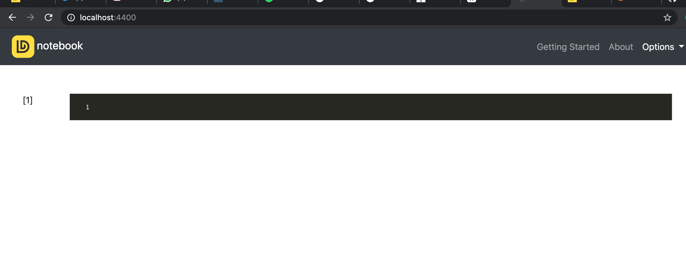

This page is the default notebook interface. From here you can start writing JavaScript or Markdown.

## Cells

Cells form the body of a notebook. In the screenshot above, the dark cell is an empty cell. There are two types of cell namely:

* **Code cell:** These cells ****contain JavaScript code to be executed and the output is displayed below.
* **Markdown cell:** These ****contain text formatted using Markdown.

### Code Cell

The first cell in a new notebook is always a code cell. Any JavaScript code can be written and executed in a code cell. Let’s test this out with the classic hello world example. Type `console.log('Hello World!')` into the code cell and click the run button.


Hovering over the code cell reveals the **run** button. Alternatively, you can use the shortcut **Ctrl + Enter** \(Win\)/ **Command + Enter** \(Mac\) to run the code cell. 


The result should look like this:

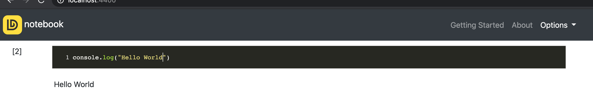

### Markdown

[Markdown](https://www.markdownguide.org/) is a lightweight markup language that you can use to add formatting elements to plaintext text documents. Markdown is written in Text cells. To create a text cell, hover over any cell and click the **Text** button. You can choose to add a markdown cell above or below the current cell. 

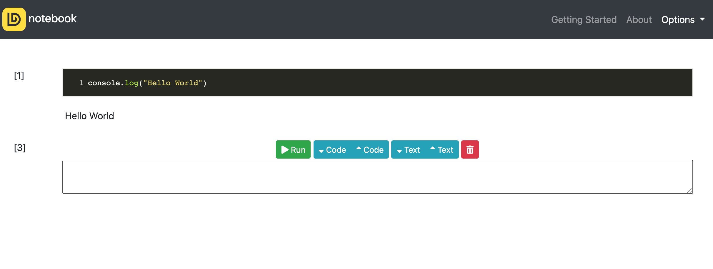

In the Text box, you can add any markdown text. For example, copy and paste the text below into the markdown text box. 

```text
# This is a level 1 heading
## This is a level 2 heading

This is some plain text that forms a paragraph.
Add emphasis via **bold** and __bold__, or *italic* and _italic_.
Paragraphs must be separated by an empty line.
* Sometimes we want to include lists.
* Which can be indented.
1. Lists can also be numbered.
2. For ordered lists.
[It is possible to include hyperlinks](https://www.example.com)
Inline code uses single backticks: `foo()`, and code blocks use triple backticks:

```
bar()
```
Or can be indented by 4 spaces:
    foo()
And finally, adding images is easy: 
```

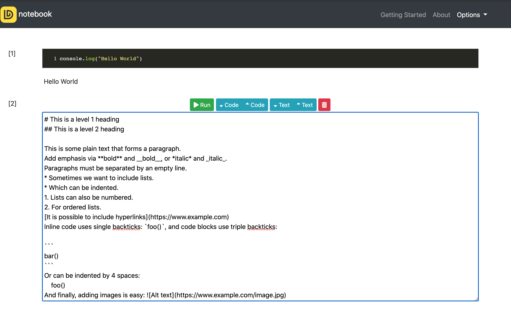

To run a markdown cell, you can double click on it, or use the run button. This renders the output in-place of the markdown text. 

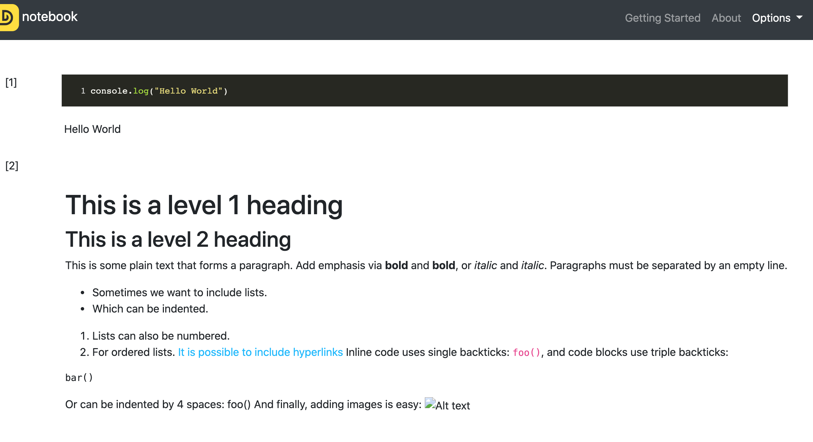


To re-edit a markdown cell, you can double click it again.


## Persistence/State

Each instance of a notebook runs a persistent state, and variables declared in any cell is available to all cells.

For example, if you load packages or declare variables in one cell, they will be available in another. In this way, you can think of a notebook document as being somewhat comparable to a script file, except that it is multimedia. Let’s try this out to get a feel for it. First, we’ll load  danfo.js and tensorflow.js packages, and then create a simple model.

```javascript
//load package downloads and install any JavaScript package via its CDN

load_package(["https://cdn.jsdelivr.net/npm/@tensorflow/tfjs@latest",
              "https://cdn.jsdelivr.net/npm/danfojs@0.2.4/dist/index.min.js"])
```


**load\_package** is a built in method to help you load libraries/packages into your notebook via their CDN links. It can accept an array of links. 


Once we’ve executed the cell above, we can reference **tf** \(Tensorflow.js\) and **dfd** \(Danfo.js\) in any other cell. For example, we can create a Danfo DataFrame from the code below:

```text
 json_data = [{ A: 0.4612, B: 4.28283, C: -1.509, D: -1.1352 },
            { A: 0.5112, B: -0.22863, C: -3.39059, D: 1.1632 },
            { A: 0.6911, B: -0.82863, C: -1.5059, D: 2.1352 },
            { A: 0.4692, B: -1.28863, C: 4.5059, D: 4.1632 }]

df = new dfd.DataFrame(json_data)
table(df)
```

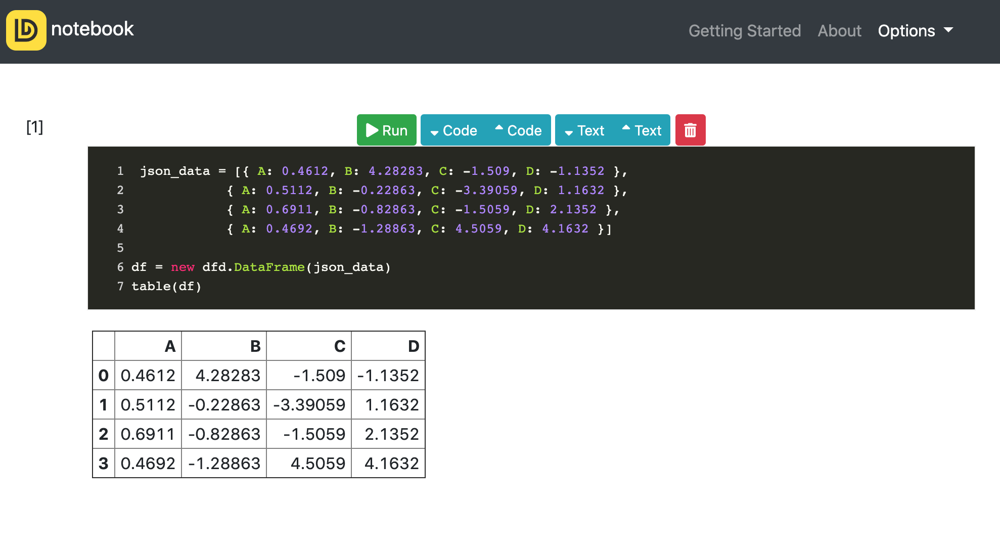


To display Danfo Objects \(DataFrame/Series\), use the inbuilt **table** function by passing the object you want to display. If you the normal **print**\(\) statement, the result gets printed to the browser console


Add a new code cell and create some simple tensors as shown below:

```javascript
var xs = tf.tensor2d([[0,0],[0,1],[1,0],[1,1]])
var ys = tf.tensor2d([[0],[1],[1],[0]])

function getModel(){
  var model = tf.sequential()
  model.add(tf.layers.dense({units:8, inputShape:2, activation: 'tanh'}))
  model.add(tf.layers.dense({units:1, activation: 'sigmoid'}))
  model.compile({optimizer: 'sgd', loss: 'binaryCrossentropy', lr:0.1})
  return model
}
```

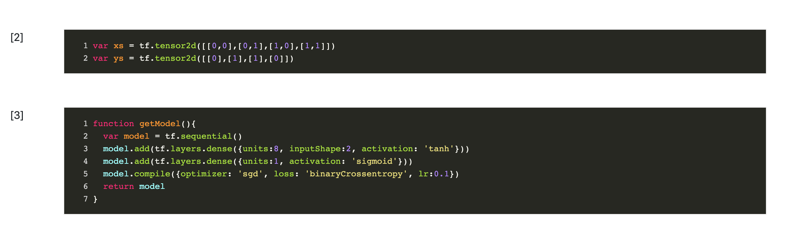

You can print out any object using the **console.log** function. This will print object both in the browser console and also in the output div below the cell. 

```javascript
console.log(xs)
```


To open the browser console use **Option + ⌘ + J** \(on macOS\), or **Shift + CTRL + J** \(on Windows/Linux\). It is encouraged to open the console when experimenting as error messages are properly formatted in the console. 


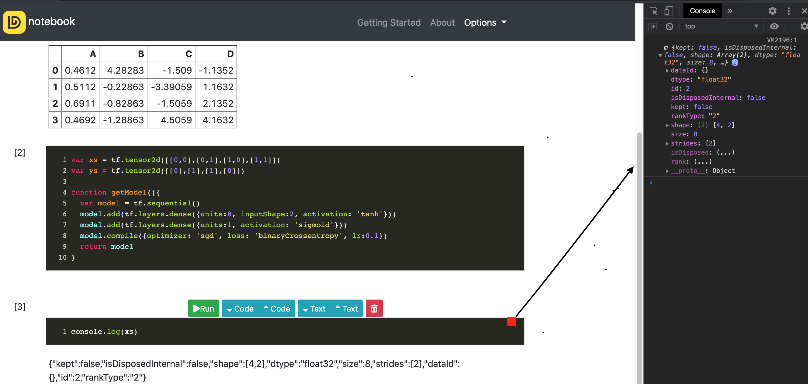


In a new cell below, you can create and train a simple model:

```javascript
var loss = []
var epochs = []
const model = getModel()

model.fit(xs, ys, {
  batchSize: 1,
  epochs: 50,
  callbacks: {
    onEpochEnd: async(epoch, logs)=>{epochs.push(epoch); loss.push((logs.loss).toFixed(4))}
  }
})
```

We save the loss after each epoch so we can plot it using Danfo.js inbuilt plotting method.

```javascript
s = new dfd.Series(loss)
s.plot(this_div()).line()
```


To plot using Danfo.js, you need to specify a div name. You can access the output div below each code cell by calling the function **this\_div\( \)**


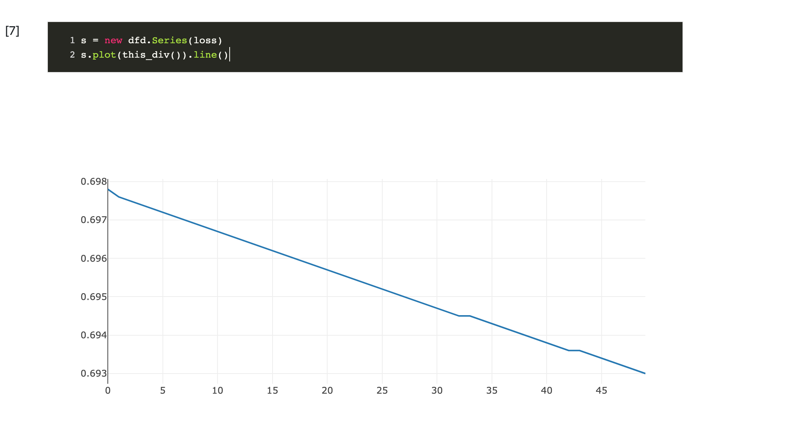

## File options

Clicking on the options tab reveals a couple of file options for you notebook:

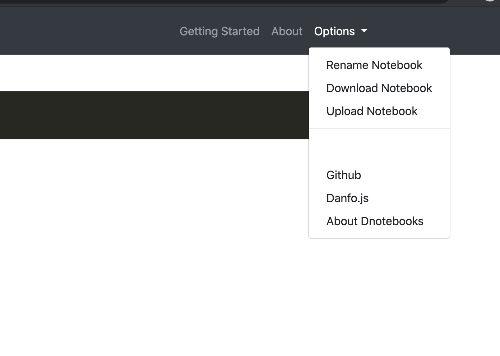

You can rename, download and also upload a notebook.

### Renaming Your Notebooks

Clicking the rename option opens a modal where you can input the name. Once you're done, click the close button.

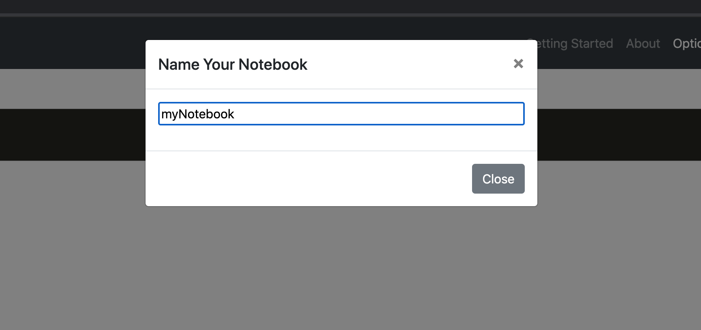

### Downloading Your Notebooks

You can download a notebook for later use. The download button saves the notebook as a JSON object that can be re-uploaded to Dnotebooks. For instance, you'll download this example notebook you've created and re-upload below:

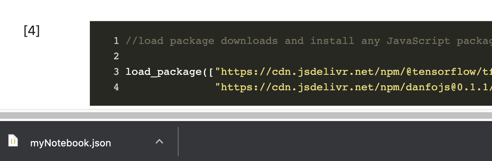

### Importing Saved Notebooks

You can upload the saved notebook from the example above. First, refresh the page, and in the new instance, click the **option** and then **upload.**

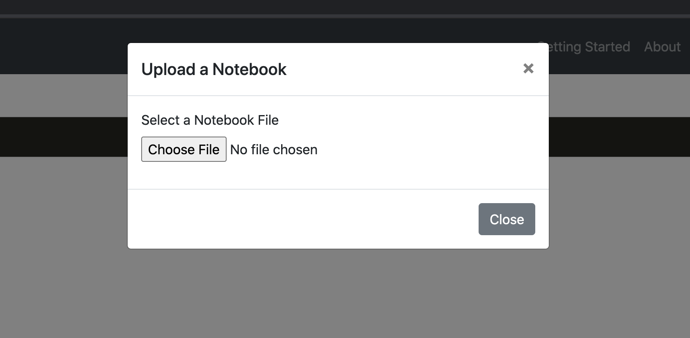

Select the file you download earlier \(myNotebook.json\). This will automatically load and display the file:

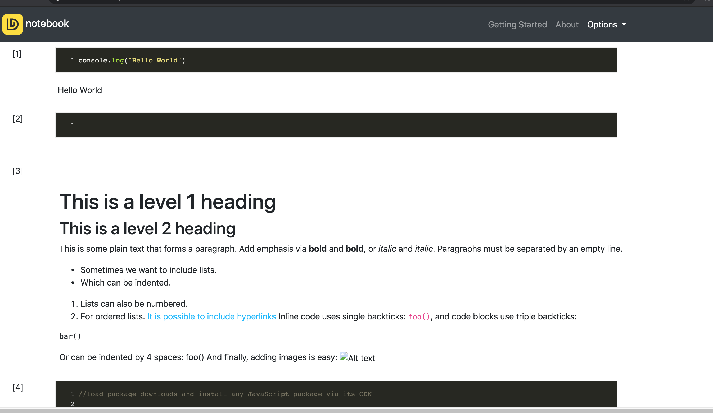

You can also interact and run the notebook as you'd do with any other notebook. 

## Extra Functions

### load\_package\(\)

The load package method helps you to easily add external packages/libraries to your notebook via their CDN links.  For instance, to load Tensorflow.js and Plotly.js, you can do the following:

```javascript
load_package(["https://cdn.jsdelivr.net/npm/@tensorflow/tfjs@latest", 
             "https://cdn.plot.ly/plotly-latest.min.js"])
```

After loading the packages, you can access them as you would normally do in an HTML page. For instance, you can plot interactive graphs as shown below:

```javascript
var trace1 = {
  x: [1, 2, 3, 4],
  y: [10, 11, 12, 13],
  mode: 'markers',
  marker: {
    size: [40, 60, 80, 100]
  }
};

var data = [trace1];

var layout = {
  title: 'Marker Size',
  showlegend: false,
  height: 600,
  width: 600
};

Plotly.newPlot(this_div(), data, layout); //this_div is a function that returns the current output div name
```

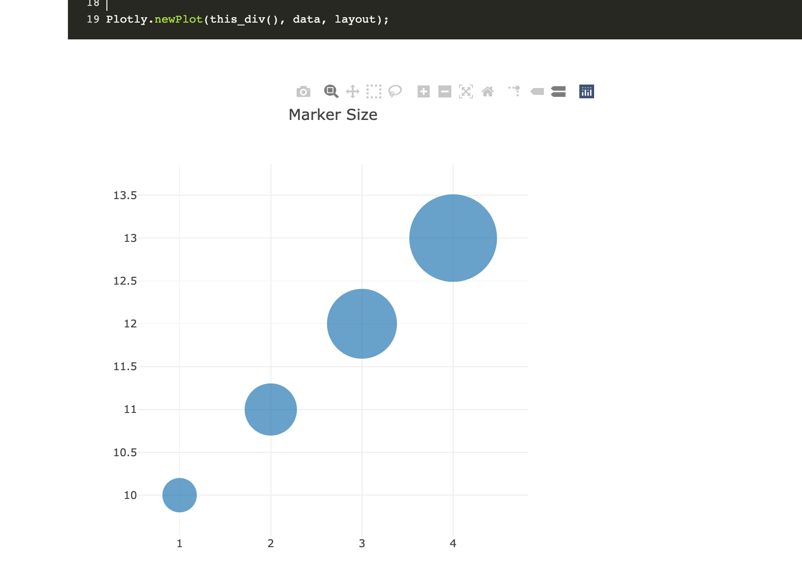

### load\_csv\(\)

The **load\_csv** function helps you load CSV files over the internet into Danfo.js DataFrame asynchronously. You should use this instead of Danfo.js built-in **read\_csv** function when reading big files and you want to track the progress. load\_csv displays a spinner on the navbar to indicate the state of the load method.

Add the following line of code to a code cell, and run it. 

```javascript
var df
load_csv("https://raw.githubusercontent.com/plotly/datasets/master/finance-charts-apple.csv")
.then((d)=>{
  df = d
})
```

If you observe the top right corner, you'll notice a spinner that indicates the state of the cell.

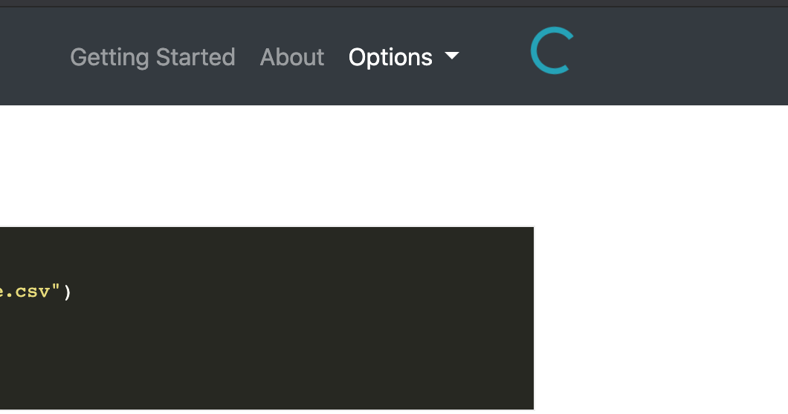

### table\(\)

To easily display Danfo.js DataFrame/series you can use the built-in **table** function. Just call it from any cell and pass in the DataFrame object. For instance, after loading the finance dataset above, you can display it as shown below:

```javascript
table(df) //displays object as a formated table
```

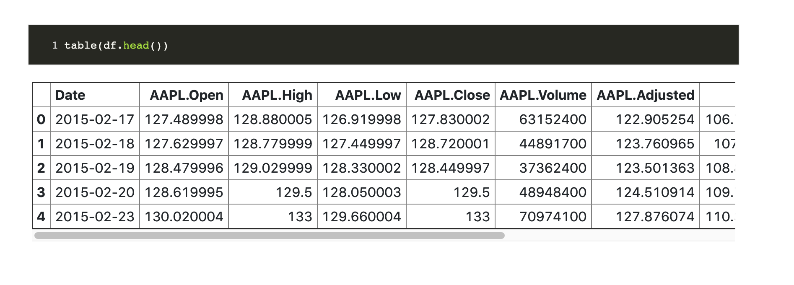

### this\_div\(\)

The function **this\_div**\(\) will return the id of the current code cell's output. This can be used when plotting, or when you want to display content in the output cell. 

See the example below which plots two columns in the finance DataFrame against a Date index.

```javascript
var layout = {
    title: 'A financial charts',
    xaxis: {
      title: 'Date',
    },
    yaxis: {
      title: 'Count',
    }
}

new_df = df.set_index({ key: "Date" })
new_df.plot(this_div()).line({ columns: ["AAPL.Open", "AAPL.High"], layout: layout })

```

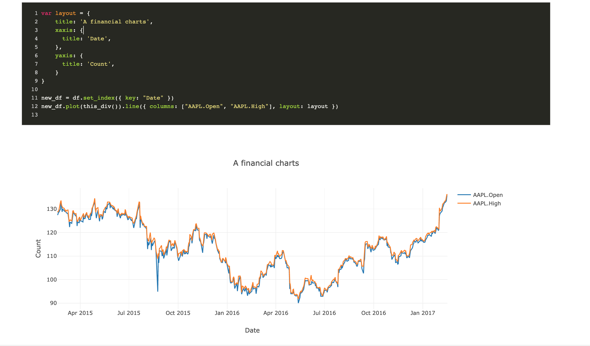

### forlog\(\)

When looping, **console.log\(\)** will only display the last element of the loop in the output cell:

```javascript
for(let i=0; i<10; i++){
  console.log(i)
}
```

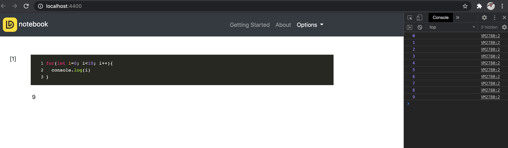

To view all elements of a loop in the output cell, you can use a custom **forlog** method as shown below:

```javascript
for(let i=0; i<10; i++){
  console.forlog(i)
}
```

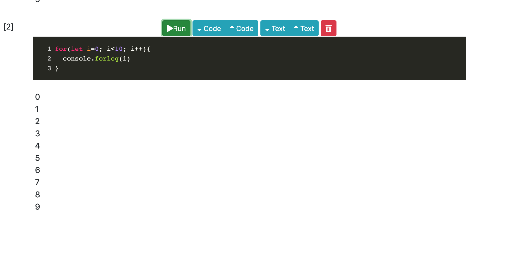

## Extra Links:

* Play with Dnotebook without installation [here](https://playnotebook.jsdata.org/demo).


